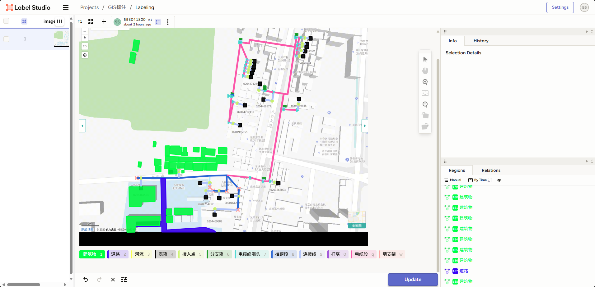
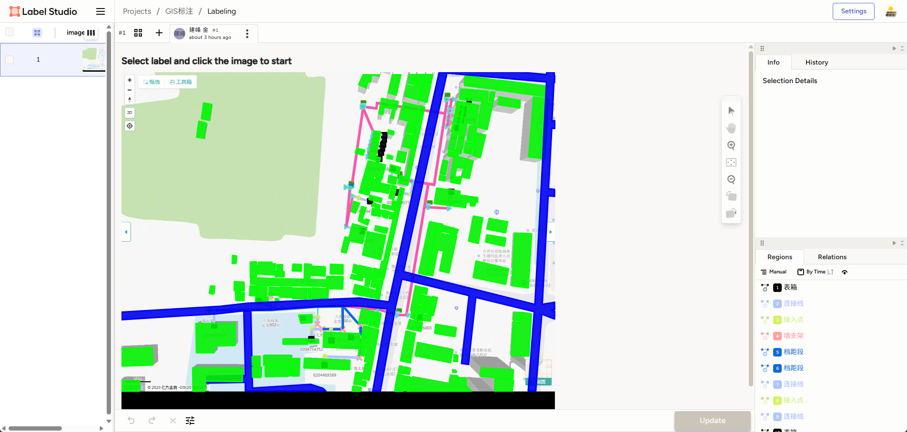
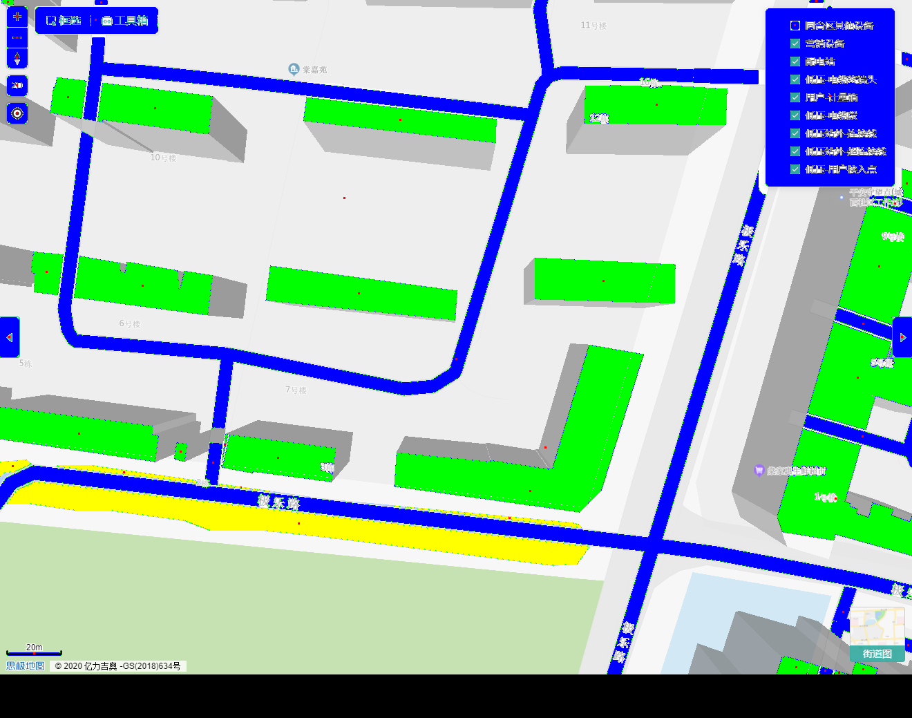

# 低压GIS美观性dy_gis_mgx 2025-07-25实施日志

## 1.制定会议纪要，确定下一步工作开展流程，详见《附件1-2025-07-25会议纪要.docx》
## 2.制定美观性评价标准，详见《附件2-2025-07-25美观性评价标准.xlsx》
## 2.安装标注工具label studio，小金实操标注了一张沿布图，经讨论，根据标注的特点，一个台区应该有三张图进行标注：
### 2.1 台区沿布图截图，隐藏所有的电力设备后，仅标注建筑、道路、河流等环境要素
### 2.2 台区沿布图治理前截图，仅标注全部的（治理前）电力设备
### 2.3 台区眼部图治理后截图，仅标注全部的（治理后）电力设备

## 3.准备500个台区，分别截取2.1隐藏电力设备的环境要素图，2.2治理前沿布图，2.3治理后沿布图。
### 3.1 由于之前PMS治理后的截图都是地形图，我们现在采用的是街道行政图，因此准备500个台区，需要金在系统内把治理过的台区，再重新渲染一边治理前坐标，治理后坐标，截图

## 4.安排5个人，周六按照金的标注流程，执行标注
### 4.1 金做的标注示例：
<!---->
### 完全标注完成
<!---->
### 4.2 标注可以单独管理隐藏或显示，可以在所有标注都做完了，隐藏掉建筑、道路等，仅显示电力设备，也可以隐藏掉所有电力设备，仅显示道路、建筑
### 4.3 （追加工序）！！！，经过讨论，小金纯手工算法计算的建筑、道路、河流可以用，将该环境要素用传统代码识别后，喂给AI识别环境要素，人工标注只标注电力设备，这样速度会快很多！下图是手写程序识别的建筑道路河流效果图，用此数据训练AI，免去人工标注建筑的巨量工作
<!---->
## 5.下一步工作计划
### 5.1 将标注后的图形和json数据整理，喂给AI，制定prompt，提示词规则
### 5.2 将美观性评价标准做成网页，由人工访问打分后，将结果格式化，总结统计，看看是不是可以以标准格式反馈给AI，每个评价跟台区挂钩

