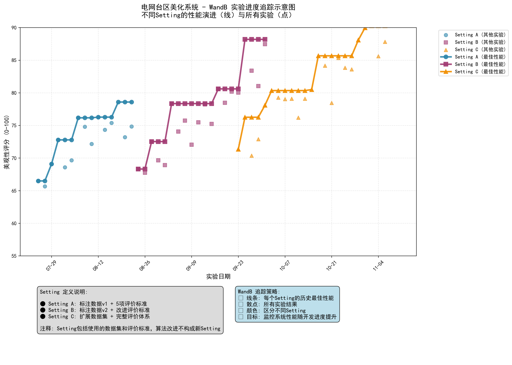

# 电网台区美化系统 - WandB 实验追踪方案

**日期**: 2025年8月7日  
**目标**: 建立系统性能随开发进度提升的追踪机制

---

## 🎯 **WandB 使用目的与目标**

### **核心目标**
通过 Weights & Biases (WandB) 建立电网台区美化系统的实验追踪体系，**明确系统性能随着开发进度的提升**，为算法优化和模型选择提供数据驱动的决策支持。

### **主要痛点解决**
1. **进度可视化**: 清晰展示从项目开始到最新实验的性能演进轨迹
2. **设置对比**: 不同数据源和评价标准组合的效果比较
3. **最优追踪**: 自动识别和维护每个设置下的历史最佳结果
4. **开发指导**: 基于实验数据指导下一步优化方向

---

## 📊 **追踪策略设计**

### **可视化策略**

#### **线条图 (Line Plot)**
- **用途**: 表示每个Setting的历史最佳性能演进
- **数据**: 从项目开始到最新的滚动最佳结果
- **颜色**: 每个Setting使用不同颜色区分
- **线型**: 实线，线宽加粗以突出重要性

#### **散点图 (Scatter Plot)**  
- **用途**: 展示所有实验结果的分布
- **数据**: 包括最佳和非最佳的全部实验点
- **颜色**: 与对应Setting的线条颜色保持一致
- **透明度**: 适度透明以避免重叠遮挡

### **Setting 定义规范**

**Setting 包含的维度**:
- ✅ **数据集版本**: 标注数据v1、v2、扩展数据集等
- ✅ **评价标准**: 5项评分标准、改进评价标准、完整评价体系等

**Setting 不包含的维度**:
- ❌ **算法改进**: Prompt优化、模型参数调整、治理逻辑修改等
- ❌ **工程优化**: 代码重构、性能优化、错误处理改进等

---

## 🗂️ **实验数据结构**

### **核心字段定义**
```python
experiment_log = {
    # 实验标识
    "experiment_id": "exp_20250807_001",
    "timestamp": "2025-08-07T14:30:00",
    
    # Setting 分类
    "setting_name": "Setting_A",
    "data_version": "标注数据v1",
    "evaluation_criteria": "5项评分标准", 
    
    # 性能指标
    "beauty_score": 78.5,           # 美观性总分 (0-100)
    "improvement_score": 12.3,      # 治理提升分数
    "dimension_scores": {
        "overhead_lines": 82,       # 架空线路部分 (20分)
        "cable_lines": 75,          # 低压电缆线路部分 (20分)
        "branch_boxes": 80,         # 分支箱部分 (20分)
        "access_points": 77,        # 接入点部分 (20分)
        "meter_boxes": 79           # 计量箱部分 (20分)
    },
    
    # 算法信息 (不影响Setting分类)
    "model_name": "qwen-vl-max",
    "algorithm_version": "v2.1",
    "prompt_version": "optimized_v3"
}
```

### **Setting 组合示例**
| Setting ID | 数据集版本 | 评价标准 | 预期用途 |
|-----------|----------|---------|---------|
| Setting_A | 标注数据v1 | 5项评分标准 | 基础baseline建立 |
| Setting_B | 标注数据v2 | 改进评价标准 | 数据质量提升验证 |
| Setting_C | 扩展数据集 | 完整评价体系 | 系统最终性能评估 |

---

## 📈 **性能指标体系**

### **主要追踪指标**
1. **美观性总分** (0-100): 系统综合评分，主要性能指标
2. **治理提升分数**: 治理前后的改善程度量化
3. **5维度分项分数**: 详细的美观性子维度评分
4. **成功率指标**: API调用成功率、JSON解析成功率等

### **次要参考指标**
- **处理时间**: 单台区处理耗时
- **成本指标**: Token使用量和费用统计
- **稳定性指标**: 错误率、重试率等

---

## 🖼️ **可视化示例**



**图表说明**:
- **实线**: 每个Setting的历史最佳性能，展示系统在该设置下的最优能力边界
- **散点**: 所有实验结果，包括成功和失败的尝试
- **颜色分组**: 不同Setting使用不同颜色，便于对比分析
- **时间轴**: 从项目开始到当前的完整开发历程

**关键洞察**:
1. **Setting C** (扩展数据集 + 完整评价体系) 达到最高性能 92.9分
2. **所有Setting** 都显示出明显的性能提升趋势
3. **数据和评价标准的改进** 对系统性能有显著影响

---

## 🛠️ **基于WandB官方功能的实施方案**

### **核心WandB功能应用**

基于[WandB实验追踪文档](https://docs.wandb.ai/tutorials/experiments/)和[WandB Models指南](https://docs.wandb.ai/guides/models)，实现目标可视化：

#### **1. 自动分组可视化**
```python
# WandB自动按group生成线图对比
wandb.init(
    project="gis-beautification",
    group="Setting_A",  # 自动分组，生成Setting对比线图
    tags=["标注数据v1", "5项评分标准"],
    config={
        "data_version": "标注数据v1",
        "evaluation_criteria": "5项评分标准"
    }
)

# 记录指标，WandB自动创建可视化
run.log({"beauty_score": 78.5})  # 主要追踪指标
```

#### **2. 最佳性能线条追踪**
- **Group功能**: 每个Setting自动形成一条线
- **滚动最佳值**: 通过WandB API计算历史最佳性能
- **颜色区分**: WandB自动为不同group分配颜色

#### **3. 散点图显示**
- **所有运行**: WandB仪表板中的scatter plot显示全部实验
- **过滤功能**: 使用tags过滤最佳实验 (`best_attempt`)
- **颜色统一**: 同一Setting的线条和散点自动保持颜色一致

### **核心实现代码**

```python
# src/tracking/wandb_tracker.py (已创建)
from src.tracking.wandb_tracker import GISExperimentTracker

# 在pipeline中集成
tracker = GISExperimentTracker()
run = tracker.start_experiment({
    "data_version": "标注数据v1",
    "evaluation_criteria": "5项评分标准"
})

# 自动记录并生成可视化
tracker.log_experiment_result(
    beauty_score=78.5,
    improvement_score=12.3,
    dimension_scores={...},
    is_best_attempt=True  # 标记最佳实验
)
```

### **WandB仪表板配置**

1. **线图面板**: 按Group显示Setting性能演进
2. **散点图面板**: 显示所有实验分布
3. **表格面板**: 详细实验对比
4. **过滤器**: 按Setting、时间、标签筛选

### **实施步骤**

1. **安装配置**: `pip install wandb` + API key设置
2. **集成代码**: 在现有pipeline中添加追踪器
3. **数据迁移**: 将历史实验数据导入WandB
4. **仪表板配置**: 设置专用的Setting对比视图

通过这种方式，WandB将自动生成你需要的线条图（最佳性能）和散点图（所有实验），并按Setting进行颜色分组，完全符合你的可视化需求。