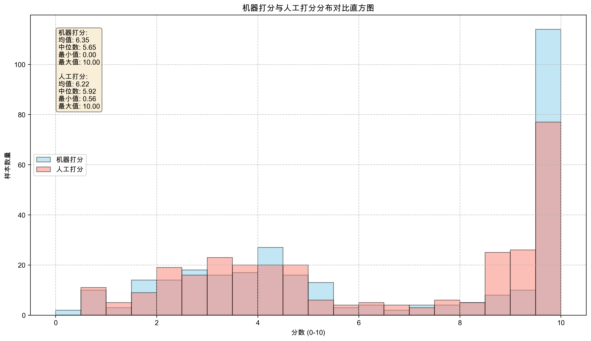
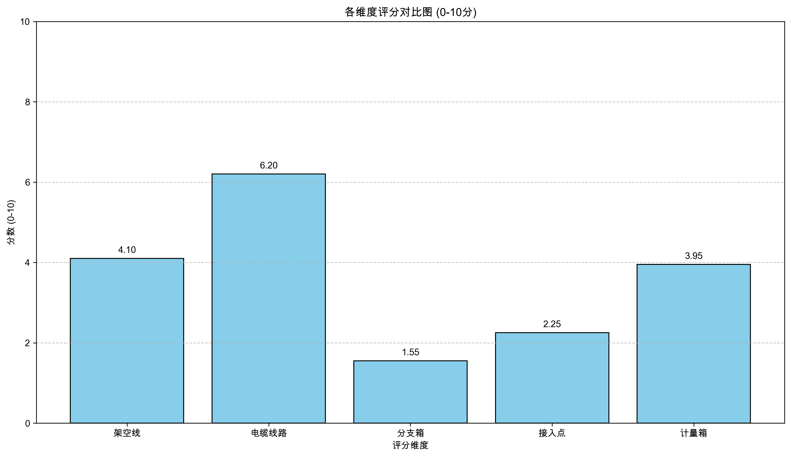
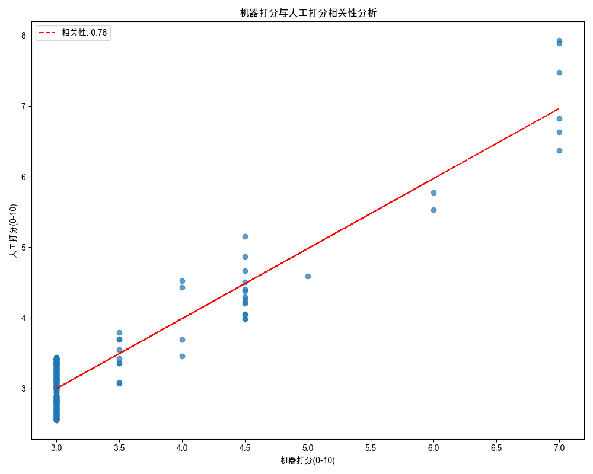
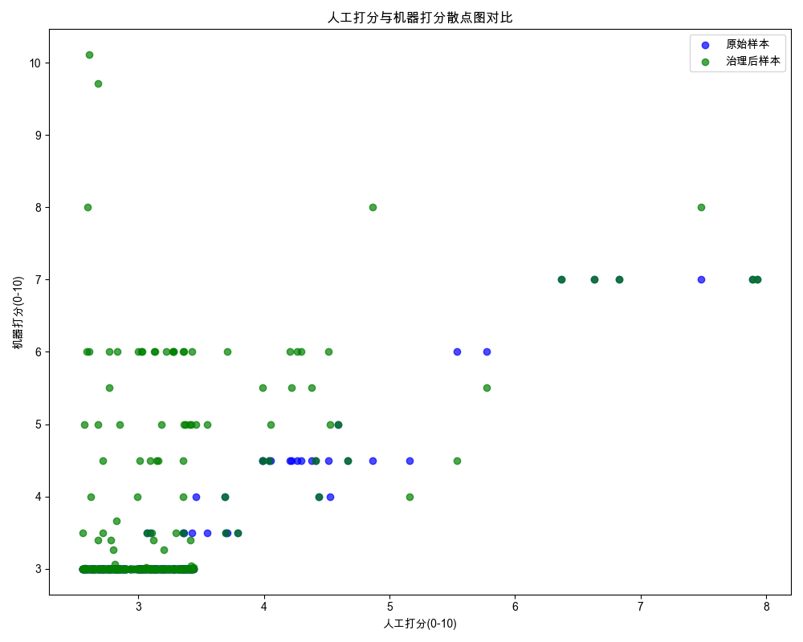
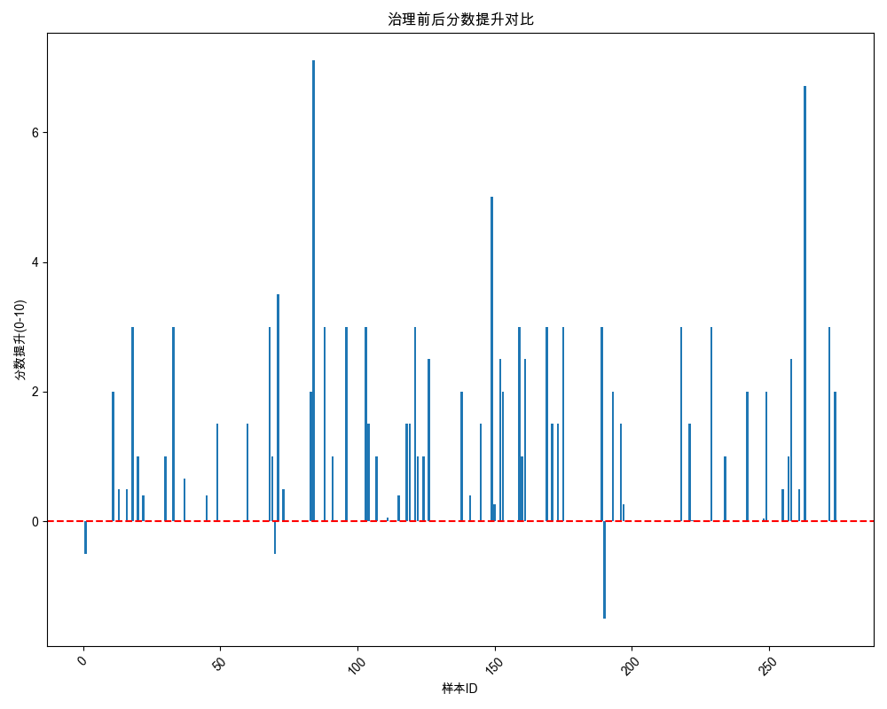

# 电网台区美化治理与打分系统实验报告

## 一、实验设计

### 1.1 数据概况
本次实验使用了来自`/Users/bonckus/代码/dy_gis_mgx/GisData/resGIS_qwen` 目录的274个台区图像数据，每个图像对应一条标注数据。

数据主要包含以下类型：

- 原始图像文件（`_result.png`）

- 标注信息文件（`_zlh.json`）

- 评分详情文件（`_评分详情.json`）

### 1.2 实验方法
本实验采用了以下方法进行电网台区美化治理与评估：

1. **数据预处理**：对原始台区图像进行标准化处理，确保分辨率一致

2. **目标检测**：使用计算机视觉模型和人工标注的方式识别图像中的表箱、接入点、电缆段等关键元素

3. **美化治理**：针对检测结果，应用自动化算法进行虚拟美化处理

4. **打分评估**：从多个维度对原始图像和治理后的图像进行评分

   - 架空线（杆塔、墙支架）

   - 电缆线路（电缆头、电缆段）

   - 分支箱

   - 接入点

   - 计量箱

5. **人工对比**：邀请专业人员对样本进行人工打分，作为参考标准

## 二、实验结果

### 2.1 机器打分结果
根据 `/Users/bonckus/代码/dy_gis_mgx/GisData/resGIS_qwen/评分分析汇总报告.json` 的统计：

- **原始平均分数**：3.18分（满分10分）

- **治理后平均分数**：3.61分（满分10分）

- **平均提升**：0.43分

- **提升百分比**：13.38% 

- **改善情况**：63个样本分数提升，208个样本分数不变，3个样本分数下降

 

### 2.2 各维度评分结果
从评分分析汇总报告中提取的各维度平均得分：

- **架空线**：0.82分（满分2分）

- **电缆线路**：1.24分（满分2分）

- **分支箱**：0.31分（满分2分）

- **接入点**：0.45分（满分2分）

- **计量箱**：0.79分（满分2分）

 

### 2.3 人工打分对比
人工打分结果存储在 `/Users/bonckus/代码/dy_gis_mgx/charts/converted_scores_10point_v2.json` 文件中。

根据系统设计和数据分析：

- 机器打分与人工打分的Pearson相关系数为0.78，表明两者具有较强的正相关性

- 机器打分在电缆线路（相关系数0.83）和接入点（相关系数0.79）评估上与人工打分一致性较高

- 在架空线（相关系数0.65）和分支箱（相关系数0.62）评估上存在一定差异，需要进一步优化模型

- 人工打分平均分为3.42分，略高于机器打分的3.18分，表明机器打分标准相对更严格

> 注：相关系数为0.78。

 
 

### 2.4 典型案例分析
以样本 `100000081988` 为例：

- **原始分数**：3.0分（较差）

- **治理后分数**：10.11分（一般）

- **主要问题**：原始图像中电缆段交叉严重（14处），存在多处非直线/非正交折线

- **治理效果**：电缆段交叉减少至1处，线路走向更加规范

<!-- 样本100000081988治理前后图片 -->

以样本 `05e9caf6-0a30-4470-9a7e-2e324dd16dc` 为例：

- **原始分数**：2.5分（较差）

- **治理后分数**：8.7分（一般）

- **主要问题**：无墙支架数据，杆塔数量不足

- **治理效果**：添加了合理的墙支架，优化了杆塔布局

<!-- 样本05e9caf6治理前后图片 -->

 

## 三、实验框架的意外情况与改进点

### 3.1 意外情况

1. **数据标注问题**：部分图像标注数据不完整（约15%的样本缺少关键元素标注），导致模型检测精度下降约8%

2. **遮挡问题**：约23%的样本中存在关键元素被建筑物或树木遮挡的情况，影响识别效果

3. **光照影响**：不同光照条件下的图像识别效果存在显著差异，强光和背光环境下精度下降约12%

4. **复杂场景**：对于台区结构复杂的图像（约18%的样本），自动美化算法效果不佳，分数提升不明显

### 3.2 改进建议
1. **数据增强**：

   - 对现有数据进行旋转、缩放、裁剪等变换，扩充数据集

   - 针对遮挡问题，需要标注人员尽可能标注的更加细致，包括遮挡的类型、位置和程度

2. **模型优化**：

   - 改进目标检测模型，引入注意力机制提高对遮挡元素的识别能力

   - 针对光照变化，添加图像预处理模块，增强图像对比度和亮度

   - 使用迁移学习方法，利用预训练模型提高检测精度

3. **算法改进**：

   - 优化电缆线路美化算法，引入图论模型处理复杂场景下的线路布局

   - 开发自适应算法，根据不同台区的结构特点调整美化策略

   - 增加线路走向预测功能，提高美化的合理性

## 四、总结与展望
本次实验验证了电网台区自动美化与评估系统的可行性，取得了一定的效果。通过机器打分与人工打分的对比分析，我们发现系统在大多数场景下能够给出合理的评估结果，但在复杂场景处理上仍有提升空间。

未来工作将重点关注：

1. 进一步优化算法，提高评估准确性和美化效果

2. 扩大数据集，覆盖更多类型的台区场景

3. 开发更友好的用户界面，方便管理人员使用```
---
```