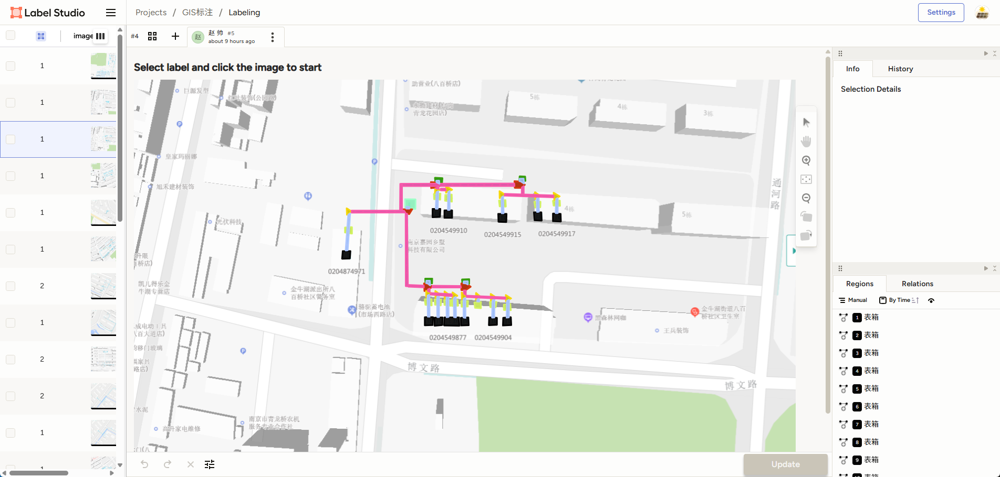
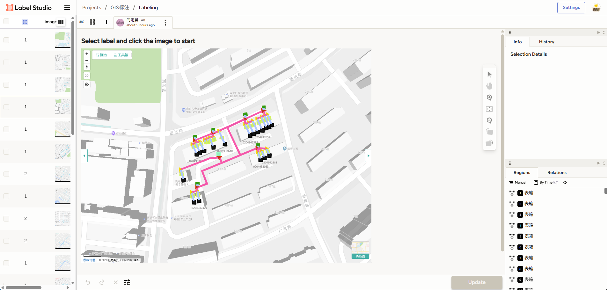
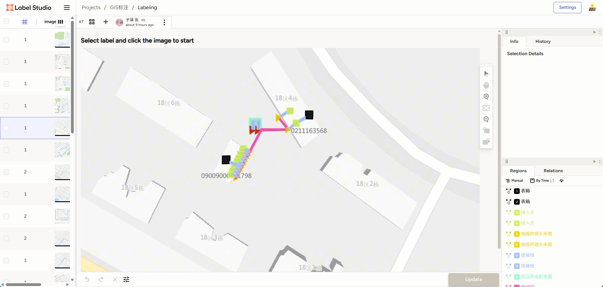
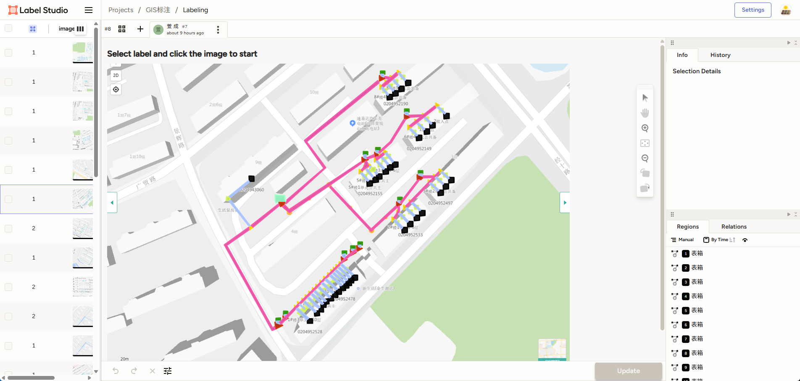
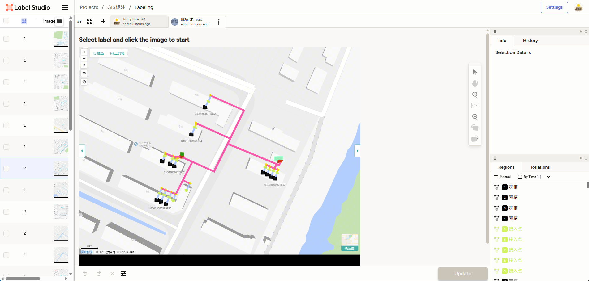
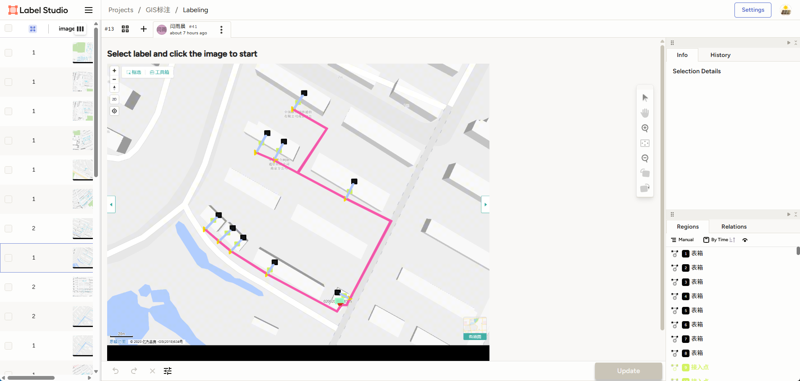

# 2025-07-26 实施日志

## 今日组织12名PMS人员，含朱威猛、赵春红，进行200个台区的治理后台区电力设备标注，治理后的台区电力设备标注。

## 小金主要修改程序，把原来存储的台区治理前数据json，进行坐标转换后，展示沿布图截图，上传到Label Studio，安排手工标注，并收集结果。

## 小金最终筛选后有151个台区可用，含治理前标注和治理后标注

## 小金现在正在做：
### 1.部署程序正在自动化截取1000-4000张仅环境要素的台区截图，预计明天早上截完，包含这151个台区，使用程序识别算法识别一边输出标注和json，把建筑、道路、河流识别出来，把数据投喂给AI，之后再测试AI是否能识别新给的任意一张图中的建筑、街道、河流，直到AI能准确识别环境要素。
### 2.把这151个台区治理前和治理后的设备标注和json，投喂给机器，让机器能够准确识别各种电力设备。
### 3.将来把151个台区治理前和治理后的截图和json数据，结合“美观性评价标准”prompt提示词，投喂给AI，让AI分别给治理前的截图打分，给治理后的截图进行打分，调试AI的打分能力，增强AI对美观性的认知程度。
#### 3.1 樊在开发一个界面，让人可以在界面上直接录入台区编号，给台区打分，打完分后，直接调出打分结果，每一条规则是否打勾，自动计算出分数，这个手工开发。想办法把结果投喂给AI即可
### 4.在AI掌握了美观性评价标准以后，调试AI，让AI能够根据投喂的任何一张治理前的台区截图和json，加上prompt，自动治理，设定好输入和输出。

### 备注：居博士指示
#### 1.如果小金有程序能有效识别建筑河流那也可以，所以我刚才问现有的技术方案怎么样了。
#### 2.ai结合一些程序，按照评价标准打分
#### 3.一定要把这个过程自动化，能自动化的打分了那离美观性自动化也就不远了
#### 4.是这个思路。一个建议是打分应该跟美观性规则挂钩（具有可解释性）。假设每张图治理后需要满足4条规则，实际满足了规则1、2、4，那分数就可以是75分（也可以根据规则的重要性加权平均）。之后也可以按照规则去分组查看、优化，比如说看看所有没有满足规则1的输入，我该如何去修改治理的算法。

#### 5.为了达到这一点，你如果（从头）训练端到端神经网络的话（图片进去、分数出来），可能会需要多个网络，或是要给每一个规则一个监督信号。如果是主要用大模型打分的话，可以让它给出治理后的图是否满足每一条规则、为什么
#### 6.可以给大模型几个例子作为参考，输入、输出和分数，然后提供一个输入让它打分，根据结果与人工打分的匹配度去更新你的输入和例子的呈现形式、提示词等等
#### 7.明确一下目前阶段”训练”对于大模型来说只包括这些，我们还没有足够的资源去微调大模型的权重
#### 8.而且项目起步阶段一般也不需要

### 2025-07-26 手工标注成果示例

